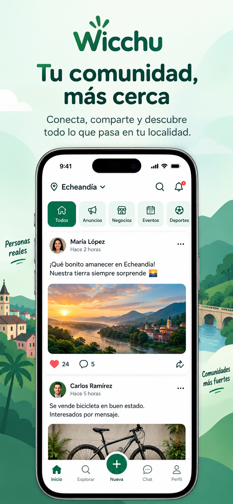

<p align="center">
  
</p>

<h1 align="center">Wicchu</h1>

<p align="center">
  Organized local communities without the social-media chaos.
</p>

Wicchu is a Flutter application for discovering local communities, sharing updates, meeting nearby people, and managing safer community conversations. It targets Android, iOS, and the web and connects to the Wicchu API hosted by the shared Hexora backend.

## App preview

<p align="center">
  
</p>

## Features

- Local discovery feeds, communities, public profiles, and people search.
- Rich posts with photos, videos, polls, categories, previews, and guided publishing.
- Direct messaging with message requests, privacy controls, pagination, typing indicators, and read receipts.
- Community roles, ownership transfer, member bans, unbanning, and moderated-post restoration.
- Reporting for posts, comments, users, communities, and administrators, including platform-level escalation.
- User safety controls such as blocking, hidden content, and account deletion.
- Personal profiles with biography, location, WhatsApp, Facebook, and Instagram details.
- Email, Google, Apple, and Facebook authentication.
- Push notifications, post sharing, and English/Spanish localization.

## Supported platforms

- Android
- iOS
- Web

## Project structure

```text
lib/
├── config/          Runtime URLs and application configuration
├── data/            HTTP and demo repository implementations
├── domain/          Models, repository contracts, and authentication contracts
├── features/        Authentication, communities, chat, profiles, and settings
├── localization/    English and Spanish interface strings
├── services/        Firebase, notifications, presence, and media services
└── widgets/         Shared interface components
```

## Development

The project requires a Flutter SDK that supports Dart `^3.10.8`.

```bash
flutter pub get
flutter run --dart-define=API_BASE_URL=https://your-api.example
```

For a local interface preview without authentication or backend requests:

```bash
flutter run -t lib/main_preview.dart
```

Preview communities are stored only in memory. The production community API is exposed under `/api/community/v1` on the backend.

## Validation

```bash
flutter analyze
flutter test
```

## Authentication configuration

### Facebook

Create a Meta application with Android package `com.wicchu.wicchu` and iOS bundle ID `com.wicchu.wicchu`.

- Backend: configure `FACEBOOK_APP_ID` and `FACEBOOK_APP_SECRET`.
- Android: configure `FACEBOOK_APP_ID` and `FACEBOOK_CLIENT_TOKEN` through user or CI Gradle properties.
- iOS: provide the Facebook values through `ios/Flutter/Debug.xcconfig` and `ios/Flutter/Release.xcconfig` deployment configuration.
- Web: build with `--dart-define=FACEBOOK_APP_ID=... --dart-define=FACEBOOK_GRAPH_VERSION=...`.

Never place `FACEBOOK_APP_SECRET` in the Flutter application. See [FACEBOOK_LOGIN_REQUIREMENTS.md](FACEBOOK_LOGIN_REQUIREMENTS.md) for Android signing certificates and Meta key hashes.

### Firebase and Google

Firebase provides push notifications and supports the Facebook credential exchange. Configure builds with the values for the Wicchu Firebase project:

```bash
flutter run \
  --dart-define=FIREBASE_API_KEY=... \
  --dart-define=FIREBASE_APP_ID=... \
  --dart-define=FIREBASE_MESSAGING_SENDER_ID=... \
  --dart-define=FIREBASE_PROJECT_ID=... \
  --dart-define=GOOGLE_WEB_CLIENT_ID=...
```

Push notifications remain disabled when Firebase configuration is absent. The backend requires the same project's service-account JSON through `FIREBASE_SERVICE_ACCOUNT_BASE64`; never commit that credential or bundle it with the app.

## Additional documentation

- [Facebook login requirements](FACEBOOK_LOGIN_REQUIREMENTS.md)
- [Backend requirements](BACKEND_REQUIREMENTS.md)
- [Moderation actions guide](MODERATION_ACTIONS_GUIDE.md)
- [App update configuration](APP_UPDATE_CONFIGURATION.md)
